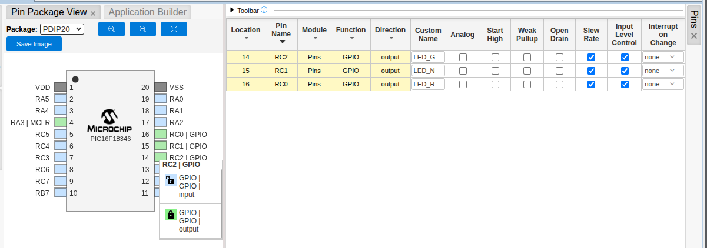
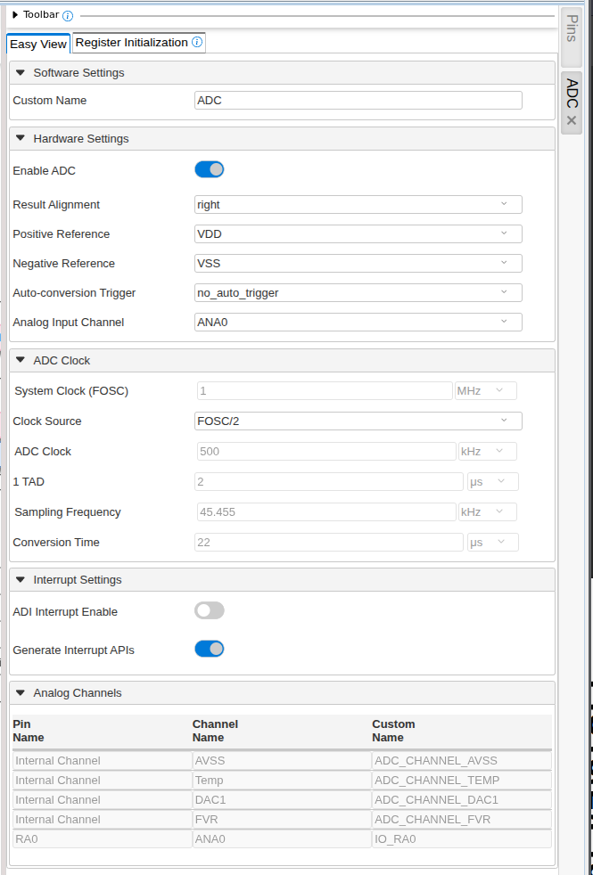
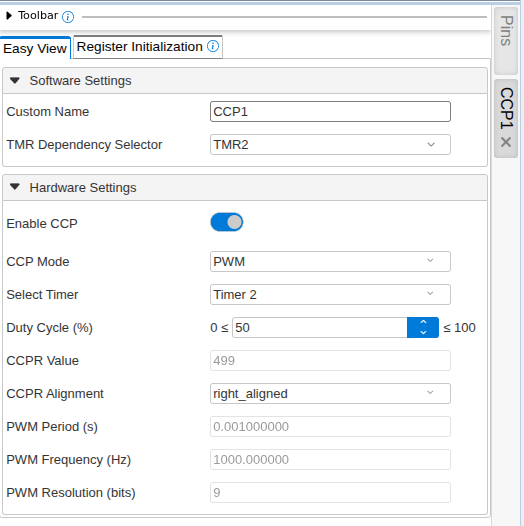
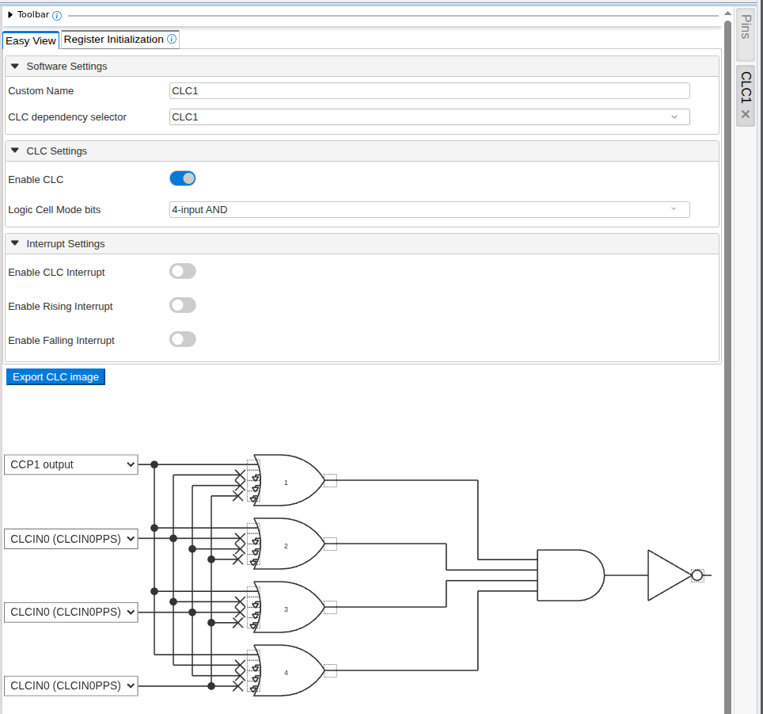
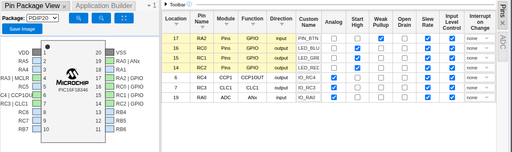

# musPICbox

Dies ist das Sourcecode Repository zu meinem Artikel in [Make](https://www.heise.de/make) 3/26, Seite 88.

Außerdem finden Sie hier eine detailiertere Anleitung zum Konfigurieren des µC mit dem MPLAB Code Configurator.

[](https://www.heise.de/make)

## Konfiguration des PIC mittels MCC

Der MPLAB Code Configurator ermöglicht die grafische Konfiguration diverser Peripherie (Clock, Timer, ADC, PWM etc.) des Microcontrollers per Mausklick. Aus den getroffenen Einstellungen erzeugt der MCC Initialisierungscode, der die Register korrekt setzt und Helferfunktionen bereitstellt.

Die Konfiguration der Pins für die LEDs veranschaulicht diesen Prozess. Nach dem Start des MCC befindet man sich in dessen Hauptfenster, dem `Application Builder`. Hier wird eine grafische Repräsentation der Firmware angezeigt. Der oberste Abschnitt zeigt alle vom User hinzugefügten Komponenten an. Momentan ist das nur die Datei `main.c`. Der mit `System` beschriftete Bereich listet die in Verwendung befindlichen System Treiber. Darunter ist der Device Abschnitt, der Infos über die MCU und ihre Fähigkeiten anzeigt. Die weißen ? auf blauen Hintergrund führen direkt zur Online Dokumentation der jeweiligen Komponenten oder UI-Elemente - sehr praktisch.

Durch einen Klick auf den `Pins` System Treiber öffnet man die `Pin Package View`. Links oben gibt es ein mit "Package" beschriftetes Drop-Down, womit man die Gehäuseform des µC festlegen kann. Wir wählen PDIP20, woraufhin im Arbeitsbereich ein Piktogramm des Chips dargestellt wird. Dem Schaltplan ist zu entnehmen, dass die LEDs mit den GPIOs `RC0`, `RC1` sowie `RC2` verbunden werden. Um dies dem MCC mitzuteilen, klicken wir nacheinander auf die entsprechenden Pins des Symbolbildes, woraufhin ein Pop-Up erscheint, mit dem wir den Pins die Funktion "GPIO | GPIO | Output" zuweisen. Daraufhin wird für jeden Pin im rechten Fenster eine Zeile zur weiteren Konfiguration hinzugefügt. In der Spalte `Custom Name` kann man einen Alias für den jeweiligen IO-Port hinterlegen, den man im Quellcode verwenden kann. Ich habe ihnen dem Schaltplan entsprechend die Namen "LED_RED", "LED_BLUE" und "LED_GREEN" zugewiesen . Außerdem ist bei allen drei LED Pins die Option `Start High` zu aktivieren. Die sorgt dafür, dass die Pins beim Booten bereits auf High gesetzt werden, was, da die LEDs "active-low" verdrahtet sind, den Effekt hat, dass keine der LEDs leuchtet.



Danach wählt man am linken Rand des MCC den Tab `Project Resource` und klickt auf den blauen Button `Generate` im linken oberen Eck. Im `Output` Fenster sieht man, welche Aktionen der MCC sodann ausführt. So erstellt er diverse Dateien im Unterverzeichnis `mmcc_generated_files/system`. In eben jenem Verzeichnis findet sich nun auch eine Datei `pins.h`. Deren Inhalt illustriert, welche Arbeit der MCC für einen übernimmt. Vor allem erstellt der MCC eine Menge Präprozessordirektiven, die uns das lästige direkte hantieren mit den Registern des Prozessors ersparen und den Umgang mit der Peripherie wesentlich vereinfachen.

Die Zeile

```C
#define LED_RED_SetHigh() do { LATCbits.LATC0 = 1; } while(0)
```

ermöglicht es beispielsweise, den Pin, an dem die rote LED hängt (hier kommen die `Custom Names` ins Spiel), durch ein simples `LED_RED_SetHigh()` im C-Code auf High zu setzen. Das Macro `LED_RED_SetHigh()` wird dabei durch den etwas seltsam anmutenden `do ... while(0)` Block ersetzt. Dieser setzt des Bit 0 im `LATC` Register auf 1 und damit den Pin auf High. Die Konstruktion mit der do-while-Schleife hat syntaktische Gründe.

Der MCC ist auch die passende Anlaufstelle um die Frequenz, mit der µC läuft einzustellen. Die Frequenzen, die wir für die Erzeugung der Töne benötigen, liegen im niedrigen kHz Bereich. Es ergibt daher wenig sinn, den PIC mit vollem Speed laufen zu lassen. Je langsamnr, desto niedriger der Stromverbrauch. Ein Klick auf das `Clock Control` Modul ermöglicht es, den Takt mit dem Dropdown `HF Internal Clock` auf 1MHz zu setzen.

Um die weiteren GPIOs zu konfigurieren gehen wir nach dem selben Muster vor. Dem Schaltplan nach wird der Taster mit dem Pin `RA2` verbunden. Also klicken wir im `Pin Package View` des MCC auf das Symbol des entsprechenden Pins und weisen ihm die Funktion "GPIO | Input" zu. Als `Custom Name` verwende ich "PIN_BTN". Außerdem setze ich das Häckchen bei `Weak Pullup`, womit der interen Pullup Widerstand aktiviert wird.

Damit ist der "einfache" Part der Konfiguration erledigt. Nun gilt es noch zwei Probleme zu lösen. Das erste ist, dass, um eine wirklich (pseudo)-zufällige Wiedergabe zu ermöglichen, wir noch einen Seed für den Zufallsgenerator benötigen. Dafür machen wir uns einen floatenden analogen Eingang zu nutze. Floatend bedeutet, dass er nicht weiter verdrahtet und somit nur einem Zufallsrauschen ausgesetzt ist. Dafür müssen wir zuerst ins `Application Builder` Fenster zurück und mittels des Knopfes `⊕Add Component` den Add Component Dialog aufrufen. Am besten filtert man in diesem die Liste der verfügbaren Komponenten, indem man ins Suchfeld den Begriff "ADC" eingibt. In den Suchergebnissen klickt man schließlich in der Zeile des ADC Moduls ganz rechts auf das ⊕ Symbol, woraufhin sich der Dialog schließt und im `Application Builder` View das neu hinzugefügte Modul unter Main angezeigt wird. Mit dem blauen Zahnradsymbol in der rosanen Komponentenbox gelangt man zur Konfiguation des ADC. Wir belassen alles auf den Standardwerten, aber ein Blick auf die angebotenen Möglichkeiten lohnt sich allemal.



Im `Pins`-Reiter sieht man auch, dass der Pin `RA0` automatisch dem ADC Modul zugewiesen wurde.

Was jetzt noch fehlt sind die zwei Pins, die das PWM Signal ausgeben sollen. Dazu sind zwei weitere Komponenten notwendig, die man wieder im `Application Builder` mittels `⊕Add Component` hinzufügen kann. Das erste ist das "CCP1" (Capture/Compare/PWM) Modul, das zweite heißt "CLC1" (Configurable Logic Cell). Nach beiden sucht man im Add Component Dialog und inkludiert sie ins Projekt mit ⊕.

Das blaue Zahnradsymbol beim "CCP1" Modul öffnet dessen Konfigurationsoptionen am rechten Rand. Den `CCP Mode` setzen wir auf PWM, was neue Optionen zum Vorschein bringt. Wählen wir nun im `TMR Dependency Selector` "TMR2" aus, wird der Timer2 als Abhängigkeit zu den Projektresourcen hinzugefügt (Reiter am linken Rand des MCC). Da die PWM und Timer Konfiguration dynamisch während des Programmablaufs geändert wird, können wir die restlichen Einstellungen auf dem Standard belassen.



Fehlt noch das CLC1 Modul. Wie bereits erwähnt, ermöglicht dieses, diverse Input Signale mit Logikblöcken zu verbinden und daraus ein Ausgangsignal zu generieren - ganz unabhängig vom Programmcode. Ein Klick auf die Komponente im `Application Builder` öffnet wiederum die Einstellungen des Moduls. Im `Logic Cell Mode bits` Dropdown bietet sich die "4-input-AND" Schaltung an. Sobald man sie ausgewählt hat, updated sich der Schaltplan im unteren Fenster und zeigt den Aufbau der Logikschaltung. Die mag auf den ersten Blick etwas ehrfurchtgebietend wirken, ist aber gar nicht kompliziert, wenn man sich in kleinen Schritten herantastet.

Unser Ziel ist es, das PWM Signal zu invertieren. Also ist es nur logisch, dass das PWM Signal als Input herhalten muss. Dafür reicht es, im ersten Dropdown den Ouptut des "CCP1" Moduls auszuwählen. Die erste Stufe der Schaltung besteht aus vier vierfach ODER Verknüpfungen, die zweite aus einer vierfach UND Verknüpfung und die dritte aus einem Buffer. Wenn man nun das Eingangssignal mit allen vier ODER Verknüpfungen verbindet, in dem man auf das strichlierte Quadrat auf der Eingangsseite der ODER Symbole klickt, bis sie mit dem Eingangssignal durch eine durchgehende Linie verbunden sind, wird das Signal direkt an alle vier Eingänge des AND Logikblocks angelegt. Das heißt, spuckt das "CCP1" eine 1 aus, liegt auch am Ausgang des ANDs eine 1 an. Diese wird nun noch durch den Buffer geschickt - der nichts anderes macht, als das Eingangssignal an seinen Ausgang durchzureichen - und wir erhalten am Ausgang der Logikzelle eine Kopie des Eingangssignals. Ziel fast erreicht; durch einen Klick auf das strichlierte Quadrat am Ausgang des Buffers fügen wir noch ein NOT-Gate hinzu, welches das Ausgangsignal des Buffers invertiert. Und somit ist nun das Ausgangssignal des "CLC1" Moduls stets invertiert zum PWM Signal.



Als letzten Schritt müssen noch die Ausgänge der Module den entsprechenden Pins zugewiesen werden. Also zurück zur `Pin Package View`. Der Buzzer ist laut Schaltplan mit den Pins `RC3` und `RC4` verbunden. Deshalb weisen wir einem von ihnen "CCP1 | CCP1OUT | output" zu, und dem anderen "CLC1 | CLC1 | output". Welcher welche Rolle übernimmt ist egal, da sie immer gegengleich betrieben werden.

Somit ist das Setup im MCC abgeschlossen und mit der `Generate`-Schaltfläche lassen wir die notwendigen Dateien vom MCC erzeugen.


